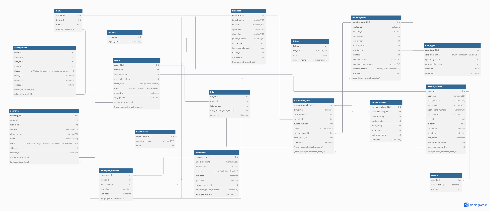

# Restaurant Management System

This repository demonstrates a sample restaurant management system, providing both a frontend (React, Vite) and a backend (Node.js, Express). It aims to streamline basic operations such as menu management and integrations (e.g., MySQL, nodemailer).

## Database Design


## Technologies Used
- Frontend:  
    - React  
    - react-router-dom  
    - react-icons  
    - axios  
    - MUI components  
    - Vite build tool  

- Backend:  
    - Node.js  
    - Express  
    - MySQL (via mysql2)  
    - cookie-parser, cors  
    - nodemailer  

## Purpose
The goal of this system is to help restaurant owners and staff manage menus, orders, and related data through a tidy, full-stack setup with a modern React-based client and an Express server.

## Demo Link
- Link video : [Click me](https://drive.google.com/file/d/1oVoCFsLmcpYsIdN2t-Ycrh-3xEtG9bFJ/view?usp=sharing)
- Link report : [Click me](https://docs.google.com/document/d/1XQJR54-CSaIr0gm7kEGvKgHgDXj0BFnb/edit?usp=drive_link&ouid=110084035331251433611&rtpof=true&sd=true)

## Getting Started

1. **Install MySQL**: Ensure that MySQL is installed on your system and the MySQL service is running.

2. **Set Up the Database**:
    - Navigate to the `SQL` folder in the repository.
    - Import and execute all SQL files to set up the necessary database schema and initial data.

3. **Install Dependencies and Start the Application**:

    - **Frontend**:
        ```bash
        cd frontend
        npm install
        npm run dev
        ```

    - **Backend**:
        ```bash
        cd backend
        npm install
        npm run dev
        ```